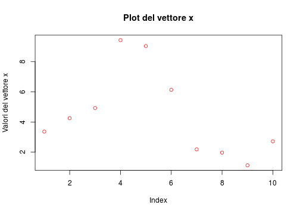
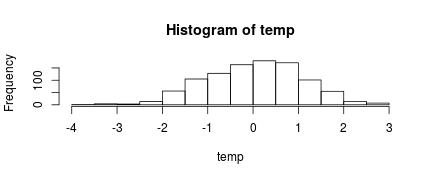
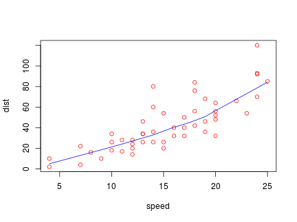
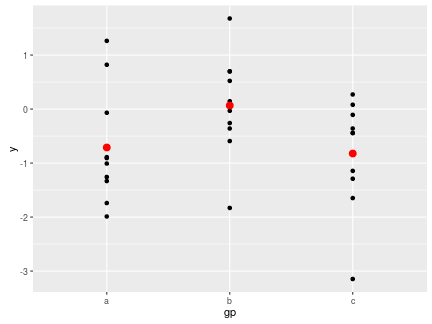
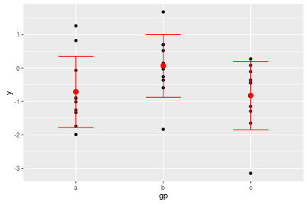

## Sommario

<p></p>

1. I dati
2. L'ambiente [[$R$](https://www.r-project.org/)](https://www.r-project.org/)
3. Perchè usare [[$R$](https://www.r-project.org/)](https://www.r-project.org/) ?
4. Gli oggetti di [[$R$](https://www.r-project.org/)](https://www.r-project.org/)
  - Scalari
  - Vettori
  - Matrici e Array
  - Dataframe
  - Liste
5. Input/Output
6. Funzioni personalizzate
7. Cenni sui cicli
8. Le funzioni grafiche

--- &vcenter

## I dati

<p></p>

--- &vcenter 

## La curva d'apprendimento


---.quote, &vcenter

## L'ambiente [$R$](https://www.r-project.org/)

L'ambiente [[$R$](https://www.r-project.org/)](https://www.r-project.org/) è caratterizzato da una __console__, dove vengono digitati i comandi, un __workspace__, dove vengono memorizzati tutti gli oggetti creati e un __editor di testo__ che permette di scrivere una serie di comandi in sequenza e salvarli in un file __nomefile.R__ chiamato _script_.

[[$R$](https://www.r-project.org/)](https://www.r-project.org/) memorizza due file ___.Rdata___ e ___.Rhistory___ nella directory di lavoro, il primo contiene tutti gli oggetti creati durante la sessione di lavoro ossia memorizza il workspace, il secondo contiene la lista dei comandi usati nella stessa sessione di lavoro.

--- .quote, &vcenter

## L'ambiente [[$R$](https://www.r-project.org/)](https://www.r-project.org/)

<h3>RGui per Windows

<p></p>


---.quote, &vcenter

## L'ambiente [$R$](https://www.r-project.org/)

<h3>[RStudio](https://www.rstudio.com/) GUI multipiattaforma

<p></p>
  

--- 

## Perchè usare [$R$](https://www.r-project.org/) ?

>1. __Libero__, per usarlo non c'è bisogno di comprare nessuna licenza.
>2. __Open source__, a codice aperto, chiunque può esaminare il codice e modificarlo per effettuare migliorie.
>3. ___Modulabile___, esistono più di 6000 packages raggruppati nel [CRAN](https://cran.r-project.org/), con funzioni che trovano applicazione in svariati campi, che possono essere installati ampliando le già notevoli potenzialità di [$R$](https://www.r-project.org/).
>4. ___Customizzabile___, chiunque può crearsi funzioni o addirittura packages su misura a seconda delle proprie esigenze.
>5. ___Multipiattaforma___, può essere installato su computer con diversi SO.
>6. ___Comunità/Supporto___, [$R$](https://www.r-project.org/) ha dietro una grossa comunità online di utilizzatori e sviluppatori che mettono a disposizione la loro esperienza a tutti, attraverso newsletter, forum, blog, siti.

---

## Perchè usare [$R$](https://www.r-project.org/) ?

Sul sito [r4stat.com](http://r4stats.com/2016/06/08/r-passes-sas-in-scholarly-use-finally/) è stato pubblicato un interessante articolo sulla popolarità dei vari software usati nell'ambito dell'elaborazione dei dati, di seguito riporto due grafici riassuntivi.


<p></p>

<p></p>


--- &vcenter

## Gli oggetti di [$R$](https://www.r-project.org/):

___Scalari numerici___

Gli scalari sono semplicemente delle variabili a cui è stato assegnato un valore che può essere numerico, logico, character(stringa).


```r
x<- 14
y<- 23
```


```r
x
```

```
## [1] 14
```

```r
y
```

```
## [1] 23
```

--- &vcenter

## Gli oggetti di [$R$](https://www.r-project.org/):

___Scalari logici___


```r
a<- TRUE
b<- FALSE

class(a)
```

```
## [1] "logical"
```

```r
a==b
```

```
## [1] FALSE
```

--- &vcenter

## Gli oggetti di [$R$](https://www.r-project.org/):

___Scalari character (stringhe)___


```r
n<- "Pasquale"
c<- "Scordino"
class(n)
```

```
## [1] "character"
```

```r
n_c<- paste(n,c)

n_c
```

```
## [1] "Pasquale Scordino"
```

--- &vcenter

## Gli oggetti di [$R$](https://www.r-project.org/):

___I vettori___

I vettori sono una seguenza monodimensionale di valori, con indice [i] che come per gli scalari possono essere numeri, logici e character (stringhe). Anche sui vettori si possono effettuare una serie di manipolazioni come per gli scalari.


```r
x<- c(23,44,55,33,66,21,32,45,65)
y<- c(TRUE,FALSE,TRUE,TRUE)
z<- c("A","B","C")
```


```r
x<- runif(10, 1, 10)
x
```

```
##  [1] 3.360735 4.252963 4.927438 9.431956 9.036599 6.135805 2.182162
##  [8] 1.969150 1.124821 2.719755
```


--- &vcenter

## Gli oggetti di [$R$](https://www.r-project.org/):

___I vettori___


```r
plot(x, main = "Plot del vettore x" ,ylab = "Valori del vettore x", col="red")
```



--- &vcenter

## Gli oggetti di [$R$](https://www.r-project.org/):

___Le matrici___

Le matrici possono essere considerate un insieme di vettori che vanno a formare una griglia di valori ___numerici___ bidimensionale con indici [i,j]


```r
m.1<- matrix(1:25, 5, 5)
m.1
```

```
##      [,1] [,2] [,3] [,4] [,5]
## [1,]    1    6   11   16   21
## [2,]    2    7   12   17   22
## [3,]    3    8   13   18   23
## [4,]    4    9   14   19   24
## [5,]    5   10   15   20   25
```


--- &vcenter

## Gli oggetti di [$R$](https://www.r-project.org/):

___Gli array___

Gli array sono un insieme di matrici che formarmano un cubo o un parallelepipedo di valori ___numerici___ tridimensionali con indici [i,j,z]


```r
m.1<- array(1:8, c(1,4,2))
m.1
```

```
## , , 1
## 
##      [,1] [,2] [,3] [,4]
## [1,]    1    2    3    4
## 
## , , 2
## 
##      [,1] [,2] [,3] [,4]
## [1,]    5    6    7    8
```

--- &vcenter

## Gli oggetti di [$R$](https://www.r-project.org/):

___Gli array___


```r
m.2<- array(1:16, c(2,4,2))
m.2
```

```
## , , 1
## 
##      [,1] [,2] [,3] [,4]
## [1,]    1    3    5    7
## [2,]    2    4    6    8
## 
## , , 2
## 
##      [,1] [,2] [,3] [,4]
## [1,]    9   11   13   15
## [2,]   10   12   14   16
```

--- &vcenter

## Gli oggetti di [$R$](https://www.r-project.org/):

___I Dataframe___

I dataframe sono delle matrici che possono contenere vettori di tutti i tipi, numerici, character (stringhe), logici


```r
L3 <- LETTERS[1:3]
L<- sample(L3, 7, replace = TRUE)
data.frame(1, 1:7, L)
```

```
##   X1 X1.7 L
## 1  1    1 A
## 2  1    2 A
## 3  1    3 A
## 4  1    4 C
## 5  1    5 A
## 6  1    6 C
## 7  1    7 C
```

--- &vcenter

## Gli oggetti di [$R$](https://www.r-project.org/):

___Le liste___

Le liste sono dei vettori che possono contenere tutti i tipi di oggetti (vettori, matrici, array, dataframe, liste)


```r
L<- list(1:3, LETTERS[1:3], 5:6)
L
```

```
## [[1]]
## [1] 1 2 3
## 
## [[2]]
## [1] "A" "B" "C"
## 
## [[3]]
## [1] 5 6
```

---

## Input/Output in [$R$](https://www.r-project.org/):

I principali comandi per ___importare___ dataset dentro l'ambiente $R$ sono:


```r
# read.csv()

# read.table()
```

I principali comandi per ___esportare___ dataset elaborati fuori l'ambiente $R$ sono:


```r
# write.csv()

# write.table()
```


--- &vcenter

## Funzioni personalizzate in [$R$](https://www.r-project.org/):

$R$ da la possibilità di costruire funzioni personalizzate che potrebbero non essere presenti nei packages di base o in quelli raccolti nel [CRAN](https://cran.r-project.org/)


```r
f<- function(x, y){ 
    z <- x^2 + y^2; 
    x+y+z }

f(0:7, 1)
```

```
## [1]  2  4  8 14 22 32 44 58
```

--- &vcenter

## Funzioni personalizzate in [$R$](https://www.r-project.org/):


```r
normistmed <- function(quantinevuoi){
              temp <- rnorm(quantinevuoi)
              hist(temp)
              mean(temp)    
              } 

normistmed(1000)
```



```
## [1] 0.02088545
```

--- &vcenter

## Le strutture di controllo (i cicli) in [$R$](https://www.r-project.org/):


```r
x <- y <- c(1:3)
for (i in 1:length(x)){  
     y[i] <- log(x[i])
     print(y[i])}
```

```
## [1] 0
## [1] 0.6931472
## [1] 1.098612
```

```r
y <- log(x)                                
y
```

```
## [1] 0.0000000 0.6931472 1.0986123
```

--- &vcenter

## Le strutture di controllo (i cicli) in [$R$](https://www.r-project.org/):


```r
sapply(x, log)
```

```
## [1] 0.0000000 0.6931472 1.0986123
```

```r
lapply(x, log)
```

```
## [[1]]
## [1] 0
## 
## [[2]]
## [1] 0.6931472
## 
## [[3]]
## [1] 1.098612
```

---

## Le funzioni di plot in [$R$](https://www.r-project.org/):

$R$ ha  una ricca quantità di funzioni e parametri per costruire qualsiasi tipo di grafico


```r
require(stats) # for lowess, rpois, rnorm
plot(cars, col="red")
lines(lowess(cars), col="blue")
```



--- &vcenter

## Le funzioni di plot in [$R$](https://www.r-project.org/):



--- &vcenter

## Le funzioni di plot in [$R$](https://www.r-project.org/):


```r
ggplot() +
  geom_point(data = df, aes(x = gp, y = y)) +
  geom_point(data = ds, aes(x = gp, y = mean),
                        colour = 'red', size = 3) +
  geom_errorbar(data = ds, aes(x = gp, y = mean,
                    ymin = mean - sd, ymax = mean + sd),
                    colour = 'red', width = 0.4)
```



---

## Grafico interattivo


<div id = 'chart1' class = 'rChart nvd3'></div>
<script type='text/javascript'>
 $(document).ready(function(){
      drawchart1()
    });
    function drawchart1(){  
      var opts = {
 "dom": "chart1",
"width":    800,
"height":    400,
"x": "Hair",
"y": "Freq",
"group": "Eye",
"type": "multiBarChart",
"id": "chart1" 
},
        data = [
 {
 "Hair": "Black",
"Eye": "Brown",
"Sex": "Male",
"Freq":             32 
},
{
 "Hair": "Brown",
"Eye": "Brown",
"Sex": "Male",
"Freq":             53 
},
{
 "Hair": "Red",
"Eye": "Brown",
"Sex": "Male",
"Freq":             10 
},
{
 "Hair": "Blond",
"Eye": "Brown",
"Sex": "Male",
"Freq":              3 
},
{
 "Hair": "Black",
"Eye": "Blue",
"Sex": "Male",
"Freq":             11 
},
{
 "Hair": "Brown",
"Eye": "Blue",
"Sex": "Male",
"Freq":             50 
},
{
 "Hair": "Red",
"Eye": "Blue",
"Sex": "Male",
"Freq":             10 
},
{
 "Hair": "Blond",
"Eye": "Blue",
"Sex": "Male",
"Freq":             30 
},
{
 "Hair": "Black",
"Eye": "Hazel",
"Sex": "Male",
"Freq":             10 
},
{
 "Hair": "Brown",
"Eye": "Hazel",
"Sex": "Male",
"Freq":             25 
},
{
 "Hair": "Red",
"Eye": "Hazel",
"Sex": "Male",
"Freq":              7 
},
{
 "Hair": "Blond",
"Eye": "Hazel",
"Sex": "Male",
"Freq":              5 
},
{
 "Hair": "Black",
"Eye": "Green",
"Sex": "Male",
"Freq":              3 
},
{
 "Hair": "Brown",
"Eye": "Green",
"Sex": "Male",
"Freq":             15 
},
{
 "Hair": "Red",
"Eye": "Green",
"Sex": "Male",
"Freq":              7 
},
{
 "Hair": "Blond",
"Eye": "Green",
"Sex": "Male",
"Freq":              8 
} 
]
  
      if(!(opts.type==="pieChart" || opts.type==="sparklinePlus" || opts.type==="bulletChart")) {
        var data = d3.nest()
          .key(function(d){
            //return opts.group === undefined ? 'main' : d[opts.group]
            //instead of main would think a better default is opts.x
            return opts.group === undefined ? opts.y : d[opts.group];
          })
          .entries(data);
      }
      
      if (opts.disabled != undefined){
        data.map(function(d, i){
          d.disabled = opts.disabled[i]
        })
      }
      
      nv.addGraph(function() {
        var chart = nv.models[opts.type]()
          .width(opts.width)
          .height(opts.height)
          
        if (opts.type != "bulletChart"){
          chart
            .x(function(d) { return d[opts.x] })
            .y(function(d) { return d[opts.y] })
        }
          
         
        
          
        

        
        
        
      
       d3.select("#" + opts.id)
        .append('svg')
        .datum(data)
        .transition().duration(500)
        .call(chart);

       nv.utils.windowResize(chart.update);
       return chart;
      });
    };
</script>

---

## Risorse web

- https://blog.rstudio.org/
- http://statisticaconr.blogspot.it/
- https://www.r-bloggers.com/
- http://www.statmethods.net/
- http://blog.revolutionanalytics.com/
- http://shinyapps.org/apps/RGraphCompendium/index.php
- http://rgraphgallery.blogspot.it/

--- 

<p></p>

## GRAZIE!!!

<p></p>


